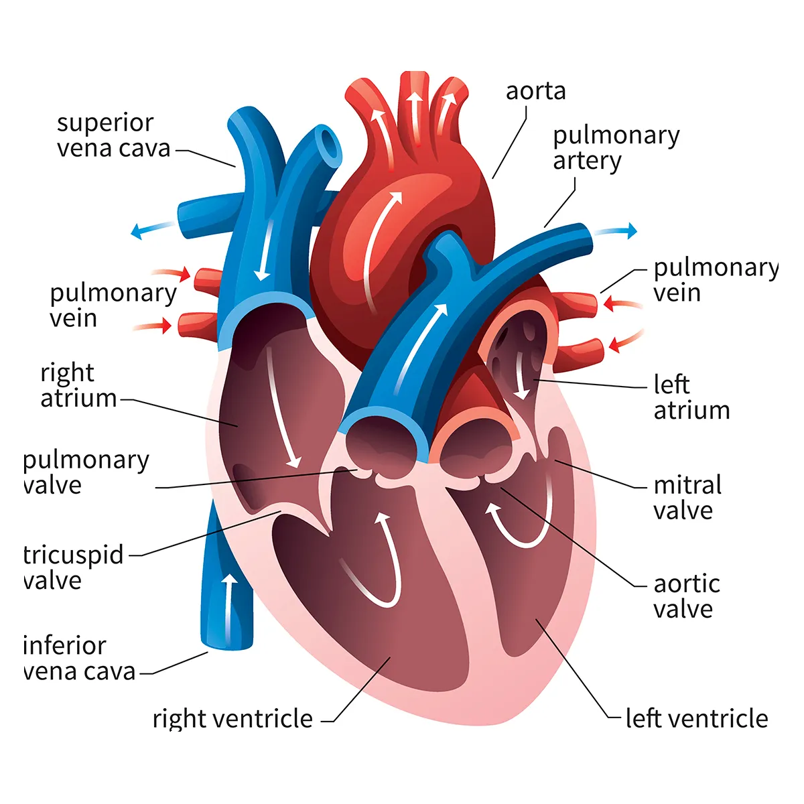
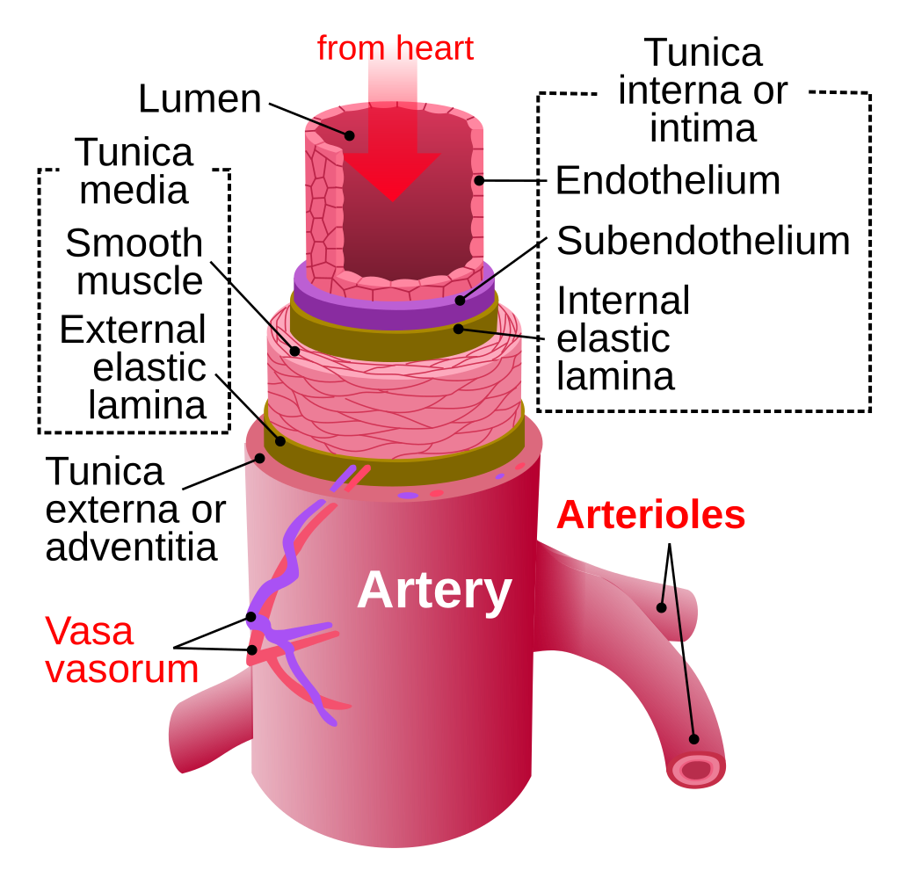
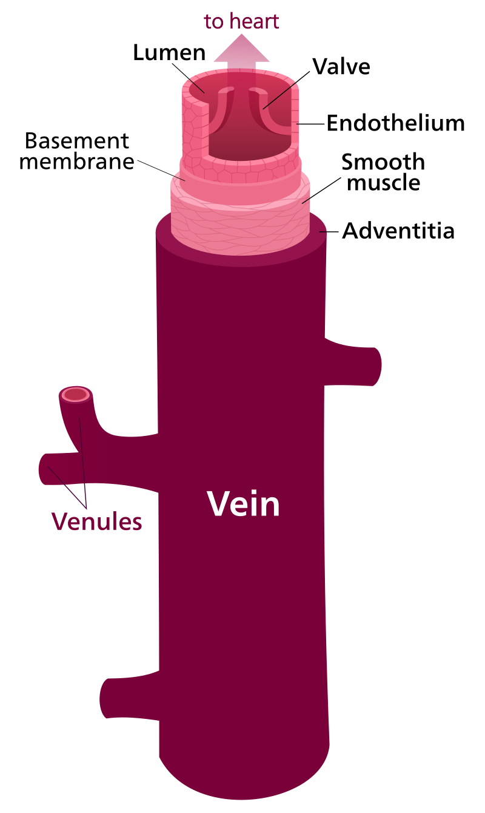
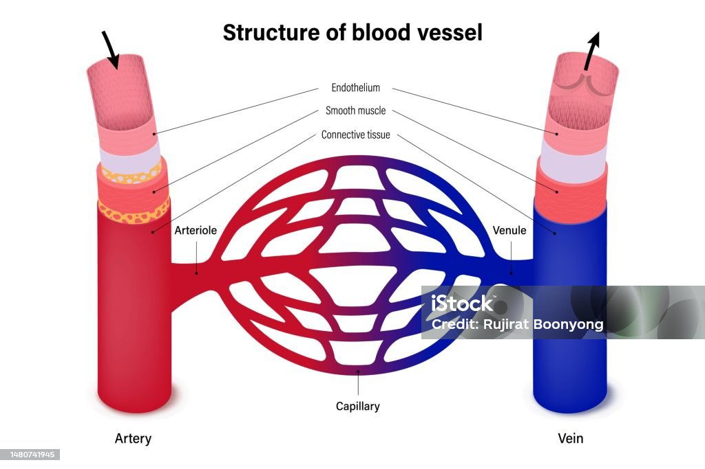
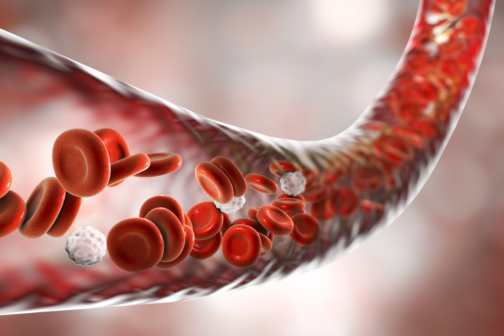

<!DOCTYPE html>
<html lang="ro">
<head>
  <meta charset="UTF-8">
  <meta name="viewport" content="width=device-width, initial-scale=1">
  <meta http-equiv="Content-Security-Policy" content="default-src 'self'; style-src 'self' 'unsafe-inline'; script-src 'self' 'unsafe-inline';">
    <!-- Fișier CSS extern pentru stilizarea paginii --> 
 <link rel="stylesheet" href="style.css">
   <title>Sistemul Circulator</title>

</head>
 

<body>
  <header>
    <h1 class="text-ro">Sistemul Circulator</h1>
 
   
Explorează misterele inimii și ale vaselor de sânge

  <h1 class="text-en" style="display: none;">Circulatory System</h1>
 
   
Explore the mysteries of the heart and blood vessels

  </header>
  
<nav id="navbar" style="display: flex; flex-wrap: wrap; justify-content: center; align-items: center; gap: 10px;">
  <a href="#despre" data-ro="Sistemul" data-en="System">Sistemul</a>
  <a href="#inima" data-ro="Inima" data-en="Heart">Inima</a>
  <a href="#artere" data-ro="Artere" data-en="Arteries">Artere</a>
  <a href="#venele" data-ro="Venele" data-en="Veins">Venele</a>
  <a href="#capilare" data-ro="Capilare" data-en="Capillaries">Capilare</a>
  <a href="#sange" data-ro="Sângele" data-en="Blood">Sângele</a>
  <a href="#grupele" data-ro="Grupele de sânge" data-en="Blood Types">Grupele de sânge</a>
  <a href="#Factorul Rh" data-ro="Factorul Rh" data-en="Rh Factor">Factorul Rh</a>
  <a href="#Factorul Rh-nul" data-ro="Factorul Rh-nul" data-en="Rh-null Factor">Factorul Rh-nul</a>
  <a href="#Circulatia sanguină" data-ro="Circulația sanguină" data-en="Blood Circulation">Circulația sanguină</a>
  <a href="#mituri" data-ro="Mit" data-en="Myth">Mit</a>
  <a href="#quiz" data-ro="Consolidare" data-en="Review">Consolidare</a>

  <button onclick="toggleLanguage()" id="languageBtn">EN</button>
 <button onclick="toggleDarkMode()" id="darkModeBtn">🌙 Dark Mode</button>
</nav>

  <main>
    <!-- Secțiunea despre sistemul circulator -->
    <section id="despre">
     <!-- Titlu RO -->
 <h2 class="text-ro">&nbsp;&nbsp;&nbsp;&nbspCe este sistemul circulator?</h2> 
    <!-- Paragraf română -->
 

 &nbsp;&nbsp;&nbsp;&nbsp;Sistemul circulator este o componentă esențială a corpului uman, susținând viața și menținând echilibrul intern. Acest sistem asigură transportul continuu al substanțelor necesare funcției celulare, cum ar fi oxigenul și nutrienții, precum și eliminarea deșeurilor din procesele metabolice. Este necesar să se examineze în detaliu principalele componente ale sistemului circulator, cum ar fi inima, vasele de sânge și vasele limfatice, pentru a înțelege semnificația și modul în care funcționează. Abordăm subiecte precum funcția celulelor roșii din sânge, grupele de sânge și modul în care toate aceste componente lucrează împreună pentru a menține sănătatea și echilibrul corpului.
   
 
      <!-- Imagine -->

 

      
     <!-- Paragraf engleză -->
    <h2 class="text-en" style="display: none;">What is the circulatory system?</h2>
 

    &nbsp;&nbsp;&nbsp;&nbsp;The circulatory system is an essential component of the human body, supporting life and maintaining internal balance. This system ensures the continuous transport of substances necessary for cellular function, such as oxygen and nutrients, and the elimination of metabolic waste. It is important to examine in detail the main components of the circulatory system—such as the heart, blood vessels, and lymphatic vessels—in order to understand how it functions. We also discuss red blood cells, blood groups, and how all these elements work together to keep the body healthy and balanced.
      
     
    <!-- Imagine -->

    </section>
         
<!-- Secțiunea despre inimă -->
     <section id="inima"> 
  
     <!-- Titluri -->
  <h2 class="text-ro">Inima</h2>
  <h2 class="text-en" style="display: none;">The Heart</h2>
   
    <!-- Paragraf română -->
     

&nbsp;&nbsp;&nbsp;&nbsp;&nbsp;&nbsp;&nbsp;&nbsp;Inima este principalul organ al sistemului circulator situat în partea stângă a cutiei toracice cu vârful sprijinit pe diafragm în formă de pară cu greutatea de 400g,alcatuită din:
     -la exterior,un sac protector numit pericard;
     -in pereți,un mușchi puternic ce se contractă involuntar și ritmic numit miocard;
     -in interior,un spațiu gol împărțit în pereți, care alcatuiesc 4 camaruțe:
     &nbsp;&nbsp;&nbsp;&nbsp;Sus:2 atrii,unul drept și unul stâng;
     &nbsp;&nbsp;&nbsp;&nbsp;Jos:2 ventricule,unul drept și unul stâng;
     &nbsp;&nbsp;&nbsp;&nbsp;Inima este un organ muscular,fapt pentru care activitatea ei este caracterizată prin contracții si relaxare,care se succed cu regularitate.Contracția inimii se numește sistolă, iar relaxarea, diastolă.O sistolă, impreuna cu diastolă formează o  revolutie cardiacă sau un ciclu cardiac care este realizat in 3 timpi/etape:
     
 I.Sistola atrială(0,1'') în care miocardul se contractă și împinge sângele din atrii în ventriculi prin orificiile antrio-ventriculare în timp ce miocardul ventricular se relaxează.
    
  II.Sistola ventriculară(0,3'') în care mușchiul ventricular se contractă și pompează sânge.
    
  III.Diastola generală(0,4'') în care atât miocardul atriilor cât și al ventriculelor se relaxează,iar sângele se întoarce la inimă  prin venele cave și pulmonare în atrii.După umplerea atriilor cu sânge,ciclul cardiac se repetă.
        
       
      <!-- Imagine -->
  
   
    <!-- Subtitlu -->
<h3 class="text-ro">&nbsp;&nbsp;&nbsp;&nbsp&nbsp;&nbsp;&nbsp;&nbsp&nbsp;&nbsp;&nbsp;&nbspCirculația sângelui prin inimă (simulare video)</h3>

<!-- Paragraf explicativ  -->

  &nbsp;&nbsp;&nbsp;&nbsp&nbsp;&nbsp;&nbsp;&nbspInima pompează sângele în două circuite: spre plămâni pentru oxigenare și spre corp pentru hrănirea celulelor. În această animație este ilustrat traseul sângelui prin inimă.

  <!-- Video integrat -->
<video id="videoInimaRO" width="600" class="text-ro">
  <source src="Realistic Heart Beat in Cross-section.mp4" type="video/mp4">
  Your browser does not support the video tag.
</video>
     <!-- Buton Start / Stop  -->
<button onclick="toggleVideo()" class="text-ro">Pornire / Oprire Video</button>

    
      <!-- Paragraf engleză -->
  

   &nbsp;&nbsp;&nbsp;&nbsp;&nbsp;&nbsp;&nbsp;&nbsp;The heart is the main organ of the circulatory system, located on the left side of the chest cavity, with its tip resting on the diaphragm. It has a pear shape, weighs 400g, and is composed of:
  – on the outside, a protective sac called the pericardium;
  – in the walls, a strong muscle that contracts involuntarily and rhythmically, called the myocardium;
  – on the inside, a hollow space divided by walls, which form 4 small chambers:
  &nbsp;&nbsp;&nbsp;&nbsp;At the top: 2 atria, one right and one left;
  &nbsp;&nbsp;&nbsp;&nbsp;At the bottom: 2 ventricles, one right and one left;
  &nbsp;&nbsp;&nbsp;&nbsp;The heart is a muscular organ, which is why its activity is characterized by regular contractions and relaxation. The contraction of the heart is calledsystole, and the relaxation, diastole. A systole together with a diastole forms a cardiac revolution or a cardiac cycle, which takes place in 3 phases/stages:
   
  I. Atrial systole (0.1'') in which the myocardium contracts and pushes the blood from the atria into the ventricles through the atrioventricular openings, while the ventricular myocardium relaxes.
  II. Ventricular systole (0.3'') in which the ventricular muscle contracts and pumps blood.
  III. General diastole (0.4'') in which both the atrial and ventricular myocardium relax, and the blood returns to the heart through the venae cavae and pulmonary veins into the atria. After the atria are filled with blood, the cardiac cycle repeats.
     
       
             <!-- Imagine -->
        
 
    <!-- Subtitlu bilingv -->
<h3 class="text-en" style="display: none;">&nbsp;&nbsp;&nbsp;&nbsp&nbsp;&nbsp;&nbsp;&nbsp&nbsp;&nbsp;&nbsp;&nbspBlood circulation through the heart (video simulation)</h3>
      <!-- Paragraf explicativ bilingv -->

  &nbsp;&nbsp;&nbsp;&nbsp&nbsp;&nbsp;&nbsp;&nbspThe heart pumps blood through two circuits: to the lungs for oxygenation and to the body to nourish the cells. This animation illustrates the path of blood through the heart.

    <!-- Video integrat -->
<video id="videoInimaEN" width="600" class="text-en" style="display: none;">
  <source src="Realistic Heart Beat in Cross-section.mp4" type="video/mp4">
  Your browser does not support the video tag.
</video>
     <!-- Buton Start / Stop bilingv -->
<button onclick="toggleVideo()" class="text-en" style="display: none;">Play / Pause Video</button>
  

   </section>

       <!-- Secțiunea despre artere -->
   <section id="artere"> 
  <h2 class="text-ro" style="text-align: center; margin-bottom: 10px;">Arterele</h2>
 
       <!-- Paragraf română -->
  

   &nbsp;&nbsp;&nbsp;&nbsp;&nbsp;&nbsp;&nbsp;&nbsp;&nbsp;&nbsp;&nbsp;&nbsp;Arterele sunt vase de sânge care pleacă de la inimă și transportă sângele către organe. Pereții arterelor conțin mult țesut elastic, ceea ce le permite să suporte presiunea ridicată a sângelui pompat de inimă.
     &nbsp;&nbsp;&nbsp;&nbsp;&nbsp;&nbsp;&nbsp;&nbsp;&nbsp;&nbsp;&nbsp;&nbsp;&nbsp;&nbsp;&nbsp;&nbsp;&nbsp;&nbsp;&nbsp;&nbsp;&nbsp;&nbsp;&nbsp;&nbsp;&nbsp;&nbsp;&nbsp;&nbsp;&nbsp;&nbsp;&nbsp;&nbsp;&nbsp;&nbsp;&nbsp;&nbsp;&nbsp;&nbsp;&nbsp;&nbsp;&nbsp;&nbsp;&nbsp;&nbsp;&nbsp;&nbsp;&nbsp;&nbsp;&nbsp;&nbsp;&nbsp;&nbsp;&nbsp;&nbsp;&nbsp;&nbsp;&nbsp;&nbsp;&nbsp;&nbsp;&nbsp;&nbsp;&nbsp;&nbsp;&nbsp;&nbsp;&nbsp;&nbsp;Cele mai mari artere din corp sunt:
     1. <u>Artera aortă</u>–pleacă din ventriculul stâng și se ramifică în artere din ce în ce mai mici, care ajung la toate organele corpului.
     2.<u> Artera pulmonară</u>–pleacă din ventriculul drept și transportă sângele până la plămân.
         
<!-- Imagine -->
 
      

      <!-- Paragraf engleză -->
<h2 class="text-en" style="display: none;">Arteries</h2>
  

    &nbsp;&nbsp;&nbsp;&nbsp;&nbsp;&nbsp;&nbsp;&nbsp;Arteries are blood vessels that carry blood away from the heart and deliver it to the organs. The walls of the arteries contain a lot of elastic tissue, which allows them to withstand the high pressure of the blood pumped by the heart.
    &nbsp;&nbsp;&nbsp;&nbsp;&nbsp;&nbsp;&nbsp;&nbsp;&nbsp;&nbsp;&nbsp;&nbsp;&nbsp;&nbsp;&nbsp;&nbsp;&nbsp;&nbsp;&nbsp;&nbsp;&nbsp;&nbsp;&nbsp;&nbsp;&nbsp;&nbsp;&nbsp;&nbsp;&nbsp;&nbsp;&nbsp;&nbsp;&nbsp;&nbsp;&nbsp;&nbsp;&nbsp;&nbsp;&nbsp;&nbsp;&nbsp;&nbsp;&nbsp;&nbsp;&nbsp;&nbsp;&nbsp;&nbsp;&nbsp;&nbsp;&nbsp;&nbsp;&nbsp;&nbsp;&nbsp;&nbsp;&nbsp;&nbsp;&nbsp;&nbsp;&nbsp;&nbsp;&nbsp;&nbsp;&nbsp;&nbsp;&nbsp;&nbsp;The largest arteries in the body are:
     <u>1. Aorta artery</u> – starts from the left ventricle and branches into smaller and smaller arteries that reach all the organs of the body.
     <u>2. Pulmonary artery</u> – starts from the right ventricle and carries the blood to the lungs. 
          
   <!-- Imagine -->
 
     

 </section>

    <!-- Secțiunea despre vene -->
<section id="venele">
       <!-- Titlu RO -->
  <h2 class="text-ro" style="text-align: center; margin-bottom: 10px;">Venele</h2>

     <!-- Paragraf RO -->
  

    &nbsp;&nbsp;&nbsp;&nbsp;&nbsp;&nbsp;&nbsp;&nbsp;Venele sunt vase de sânge care transportă sângele de la organe înapoi la inimă. Pereții venelor conțin mai puțin țesut elastic, comparativ cu arterele, deoarece sângele circulă prin ele cu o presiune mai scăzută. Multe vene, mai ales cele din membrele inferioare, conțin valve care împiedică întoarcerea sângelui în sens invers.
     
    &nbsp;&nbsp;&nbsp;&nbsp;&nbsp;&nbsp;&nbsp;&nbsp;&nbsp;&nbsp;&nbsp;&nbsp;&nbsp;&nbsp;&nbsp;&nbsp;&nbsp;&nbsp;&nbsp;&nbsp;&nbsp;&nbsp;&nbsp;&nbsp;&nbsp;&nbsp;&nbsp;&nbsp;&nbsp;&nbsp;&nbsp;&nbsp;&nbsp;&nbsp;&nbsp;&nbsp;&nbsp;&nbsp;&nbsp;&nbsp;&nbsp;&nbsp;&nbsp;&nbsp;&nbsp;&nbsp;&nbsp;&nbsp;&nbsp;&nbsp;&nbsp;&nbsp;&nbsp;&nbsp;&nbsp;&nbsp;&nbsp;&nbsp;&nbsp;&nbsp;&nbsp;&nbsp;&nbsp;&nbsp;&nbsp;&nbsp;&nbsp;&nbsp;Cele mai mari vene din corp sunt:
     
    <u>1. Venele cave</u> – transportă sângele de la organe la inimă. Există 2 vene cave:
     
    &bull;Vena cavă superioară – colectează sângele din partea superioară a corpului.
     
    &bull;Vena cavă inferioară – colectează sângele din partea inferioară a corpului.
     
    <u>2. Venele pulmonare</u> – aduc sângele oxigenat de la plămâni la inimă, în atriul stâng.
       

     <!-- Titlu EN -->
  <h2 class="text-en" style="display: none; text-align: center; margin-bottom: 10px;">Veins</h2>

        <!-- Paragraf EN -->
   

    &nbsp;&nbsp;&nbsp;&nbsp;&nbsp;&nbsp;&nbsp;&nbsp;Veins are blood vessels that carry blood from the organs back to the heart. The walls of veins contain less elastic tissue compared to arteries, because blood flows through them at a lower pressure. Many veins, especially those in the lower limbs, contain valves that prevent the blood from flowing backward.
     
    &nbsp;&nbsp;&nbsp;&nbsp;&nbsp;&nbsp;&nbsp;&nbsp;&nbsp;&nbsp;&nbsp;&nbsp;&nbsp;&nbsp;&nbsp;&nbsp;&nbsp;&nbsp;&nbsp;&nbsp;&nbsp;&nbsp;&nbsp;&nbsp;&nbsp;&nbsp;&nbsp;&nbsp;&nbsp;&nbsp;&nbsp;&nbsp;&nbsp;&nbsp;&nbsp;&nbsp;&nbsp;&nbsp;&nbsp;&nbsp;&nbsp;&nbsp;&nbsp;&nbsp;&nbsp;&nbsp;&nbsp;&nbsp;&nbsp;&nbsp;&nbsp;&nbsp;&nbsp;&nbsp;&nbsp;&nbsp;&nbsp;&nbsp;&nbsp;&nbsp;&nbsp;&nbsp;&nbsp;&nbsp;&nbsp;&nbsp;&nbsp;&nbsp;The largest veins in the body are:
     
    1.<u> Venae cavae</u> – carry blood from the organs to the heart. There are two venae cavae:
     
    &bull;Superior vena cava – collects blood from the upper part of the body.
     
    &bull;Inferior vena cava – collects blood from the lower part of the body.
     
    2.<u> Pulmonary veins</u> – bring oxygenated blood from the lungs to the heart, into the left atrium.
  

   
       <!-- Imagine -->

</section>

       <!-- Secțiunea despre capilare -->
<section id="capilare">

      <!-- Titluri -->
  <h2 class="text-ro" style="text-align: center; margin-bottom: 10px;">Capilarele</h2>
  <h2 class="text-en" style="display: none; text-align: center; margin-bottom: 10px;">Capillaries</h2>

     <!-- Paragraf română -->
  

    &nbsp;&nbsp;&nbsp;&nbsp;&nbsp;&nbsp;&nbsp;&nbsp;Capilarele sunt cele mai mici vase de sânge (0,5 mm lungime și 30&nbsp;micrometri în diametru), ce fac legătura dintre arterele și venele mici. Au pereții foarte subțiri, formați dintr-un singur strat de celule. Au un rol foarte important în asigurarea schimbului de substanțe dintre sânge și celule.
   

   
     <!-- Paragraf engleză -->
  

    &nbsp;&nbsp;&nbsp;&nbsp;&nbsp;&nbsp;&nbsp;&nbsp;Capillaries are the smallest blood vessels (0.5 mm in length and 30 micrometers in diameter), connecting small arteries and veins. They have very thin walls made of a single layer of cells. They play a vital role in the exchange of substances between the blood and the body’s cells.
       

    
     <!-- Imagine -->

</section>

      <!-- Secțiunea despre sânge -->
       <section id="sange">

       <!-- Titluri-->
  <h2 class="text-ro" style="text-align: center; margin-bottom: 10px;">Sângele</h2>
  <h2 class="text-en" style="display: none; text-align: center; margin-bottom: 10px;">Blood</h2>
       <!-- Paragraf RO -->
  

    &nbsp;&nbsp;&nbsp;&nbsp;&nbsp;&nbsp;&nbsp;&nbsp;Sângele este principalul lichid al corpului, de culoare roșie, care reprezintă 6–8% din masa corporală, format din plasma sanguină și elementele figurate:
     <i>I. Plasma sanguină</i> este partea lichidă ce ocupă 55% din volumul total al sângelui, formată din 90% apă, substanțe anorganice (săruri), dar și organice (proteine, lipide, glucide). În contact cu aerul, ajută la coagulare.
     <i>II. Elemente figurate:</i>
     a) Celule roșii = HEMATII sau ERITROCITE
     Celule roșii fără nucleu (anucleate),cu forma celulara privită din fată,iar din profil de lentilăcu  biconcavă, care trăiesc 120 de zile. Sunt produse în măduva roșie a oaselor late și distruse în splină și ficat. Transportă oxigenul de la plămâni la celule și CO₂ înapoi.
     b) Globule albe = LEUCOCITE
     Celule incolore care trăiesc de la câteva zile până la câțiva ani. Se produc în măduvă, splină, ganglioni, amigdale. Au rol esențial în imunitate.
     c) Trombocite = plachete sanguine
     Cele mai mici celule ale sângelui (200.000–400.000/mm³), care trăiesc câteva zile. Ajută la coagulare prin formarea cheagurilor la locul ruperii unui vas.
  

  

    &nbsp;&nbsp;&nbsp;&nbsp;&nbsp;&nbsp;Lichidul interstițial, numit și limfă interstițială, este prezent între celule și permite schimbul de substanțe necesare metabolismului. Se formează din plasma sanguină care iese din capilare și pătrunde în spațiile celulare.
  

  

    &nbsp;&nbsp;&nbsp;&nbsp;&nbsp;&nbsp;Limfa, sau sângele alb, se formează din lichidul interstițial în momentul pătrunderii în capilarele limfatice. Are o culoare  alb-gălbuie, o compoziție asemănătoare sângelui dar fără celule roșii și cu mai multe leucocite. Circulă prin vase limfatice care se varsă în vene. 
  

       <!-- Paragraf EN -->
  

    &nbsp;&nbsp;&nbsp;&nbsp;&nbsp;&nbsp;&nbsp;&nbsp;Blood is the main fluid of the body, red in color, and represents 6–8% of the body mass. It is composed of blood plasma and formed elements:
     <i>I. Blood plasma</i> is the liquid part, representing 55% of the total blood volume. It is made of 90% water, inorganic substances (salts), and organic compounds (proteins, lipids, glucose). When in contact with air, it helps coagulation.
     <i>II. Formed elements:</i>
     a) Red blood cells = ERYTHROCYTES
     Red cell, anucleate, with a round shape when viewed from the front, and a biconcave lens profile when viewed from the side. They live 120 days, are produced in red bone marrow, and destroyed in the spleen and liver. They transport oxygen and bring CO₂ back.
     b) White blood cells = LEUKOCYTES
     Colorless cells that live from a few days to several years. Produced in marrow, spleen, lymph nodes, and tonsils. They play a key role in immunity.
     c) Platelets = thrombocytes
     The smallest blood cells (200,000–400,000/mm³), live a few days. They help in clotting by forming clumps at the site of a broken vessel.
  

  

    &nbsp;&nbsp;&nbsp;&nbsp;&nbsp;&nbsp;Interstitial fluid, also called interstitial lymph, is found between cells and enables the exchange of substances that support metabolism. It forms at the level of capillaries when plasma passes into surrounding tissues.
  

  

    &nbsp;&nbsp;&nbsp;&nbsp;&nbsp;&nbsp;Lymph, also known as white blood, forms from interstitial fluid when it enters lymphatic capillaries. It is yellowish-white in color and has a composition similar to blood but without red blood cells and with more white cells. It flows through lymphatic vessels which drain into veins. It differs from blood by the absence of erythrocytes.
  

    
      <!-- Imagine -->
   

</section>

     <!-- Secțiunea despre grupele de sânge -->
         <section id="grupele">
       <!-- Titluri -->
  <h2 class="text-ro" style="text-align: center; margin-bottom: 10px;">Grupele de sânge</h2>
  <h2 class="text-en" style="display: none;">Blood Types</h2>
       <!-- Paragraf RO -->
  

       &nbsp;&nbsp;&nbsp;&nbsp;La om există grupe de sânge determinate de prezența pe globulele roșii a unor substanțe numite ANTIGENE și de prezența în plasmă a unor ANTICORPI împotriva acestor antigene.Exista 4 grupe:
       Grupa 0(I)-nu are antigene A și B și are în plasma anticorpi anti A și anti B;
       Grupa A(II)-are pe hematii antigenul A și are în plasmă anticorpi anti B.
       Grupa B(III)-are pe hematii antigenul B și în plasmă  anticorp anti A;
       Grupa AB(IV)-are pe hematii antigen A și B dar nu are în plasmă anticorpi;
       &nbsp;&nbsp;&nbsp;Ca să înțelegem mai bine ce este antigenul si anticorpii le vom defini mai clar.
       <b>Antigenul</b> este o substanță, de obicei o proteina sau carbohidră care se află pe celulele roșii, ce determină grupa de sânge.Îar <b>anticorpul</b> este o proteină ce  aparare în plasmă cu scopul de a identifica și a ataca orice celulă straină. 
      
 
       &nbsp;&nbsp;&nbsp;&nbsp;Este important sa ne cunostem grupa de sânge deoarece în momentul unei  transfuzii, primirea unei grupe incompatibile produce lipirea hematiilor printr-o  reactie numită  glutinare și blocarea veselor de sânge,ceea ce duce,în cazuri grave,la deces.
      
     
       Ce grupa de sânge poți moșteni de la parinții tăi?
       &nbsp;&nbsp;&nbsp&nbsp;La fel ca și culoare ochiilor,grupele de sânge se moștenes genetic de la părinți.
        
     
  

 

  

  <h3>🧪 Simulare: Află ce grupă ai!</h3>
  
Bifează antigenele de pe hematii și anticorpii din plasmă:

  <form>
    <label><strong>Antigene:</strong></label> 
    <input type="checkbox" id="antigenA-ro"> A
    <input type="checkbox" id="antigenB-ro"> B
      

    <label><strong>Anticorpi:</strong></label> 
    <input type="checkbox" id="anticorpA-ro"> anti-A
 <input type="checkbox" id="anticorpB-ro"> anti-B

      

    <button type="button" onclick="determinaGrupa()">🔍 Află grupa</button>
  </form>

  

  
 

      <!-- Paragraf EN -->
 

   &nbsp;&nbsp;&nbsp;&nbsp; In humans, blood groups are determined by the presence of substances called ANTIGENS on red blood cells and by the presence of ANTIBODIES in the plasma against these antigens. There are 4 blood groups:
   Type O-it has no A or B antigens, but its plasma contains anti-A and anti-B antibodies.
   Type A-it has A antigens on the red blood cells and anti-B antibodies in the plasma
   Type B-it has B antigens on the red blood cells and anti-A antibodies in the plasma.
   Type  AB-it has both A and B antigens on the red blood cells and no antibodies in the plasma.
  &nbsp;&nbsp;&nbsp;To better understand what antigens and antibodies are, we will define them more clearly.
   <b>The Antigen</b> is a substance, usually a protein or a carbohydrate, found on red blood cells that determines the blood type.And <b> antibody</b> it  is a protein found in the plasma, whose role is to defend the body by identifying and attacking any foreign cell.
     
     <!-- Imagine -->
 
  &nbsp;&nbsp;&nbsp;&nbsp;It is important to know our blood type because during a transfusion, receiving an incompatible blood type causes the red blood cells to stick together through a reaction called  agglutination, blocking the blood vessels, which can, in severe cases, lead to death.
     
  <!-- Imagine -->

 What blood type can you inherit from your parents?
 &nbsp;&nbsp;&nbsp&nbsp;Just like eye color, blood types are inherited genetically from our parents.
     
       <!-- Imagine -->

  <h3>🧪 Simulation: Find your blood type!</h3>
  
Check the antigens on red cells and antibodies in plasma:

  <form>
    <label><strong>Antigens:</strong></label> 
    <input type="checkbox" id="antigenA-en"> A
    <input type="checkbox" id="antigenB-en"> B
      

    <label><strong>Antibodies:</strong></label> 
    <input type="checkbox" id="anticorpA-en"> anti-A
    <input type="checkbox" id="anticorpB-en"> anti-B
      

    <button type="button" onclick="determinaGrupa()">🔍 Find blood type</button>
  </form>

  

  

</section>
  
       <!-- Secțiunea despre factorul Rh -->
 <section id="Factorul Rh">
       <!-- Titluri -->
  <h2 class="text-ro" style="text-align: center; margin-bottom: 10px;">Factorul Rh</h2>
  <h2 class="text-en" style="display: none; text-align: center; margin-bottom: 10px;">The Rh factor</h2>
      <!-- Paragraf RO -->
  

     &nbsp;&nbsp;&nbsp;&nbsp;&nbsp;&nbsp;&nbsp;&nbsp;Factorul Rh este o proteină moștenită care se gașeste pe suprafața celulelor roșii din sânge.Daca în sânge se regasește  proteina atunci sunteti Rh pozitiv.Daca pe suprafața celulelor roșii nu există atunci sunteți Rh negativ.
     &nbsp;&nbsp;&nbsp;&nbsp;&nbsp;&nbsp;&nbsp;De ce este important Rh?
     &nbsp;&nbsp;&nbsp;Ei bine Rh este important în momentul unei transfuzii deoarece o persoana cu  Rh⁺ nu poate primi o transfuzie cu Rh⁻ ,deoarece organismul îl va recunoaște ca pe un „străin” și va începe să producă anticorpi împotriva Rh,un proces numit „sensibilizare".Acesta mai este important și în momentul sarcinii deoarece daca mama are Rh⁻, dar copilul are Rh⁺, mama poate produce anticorpi care luptă cu celulele roșii ale copilului. Acest lucru se poate întâmpla daca sângele copilului nenascut ajunge în circulatia mamei, ceea ce se întampla rar, cel mai des în timpul nasterii. 
     &nbsp;&nbsp;&nbsp;&nbsp; Atunci când există acest risc (avort spontan, traumatisme abdominale, la nastere), o injectie cu anticorpi anti-D poate fi administrată mamei.
     &nbsp;&nbsp;&nbsp;&nbsp;De obicei prima sarcină nu este afectată de compatibilitatea Rh deoarece copilul este adesea născut înainte ca mulți anticorpi să se dezvolte.Dar foarte importatant este ca la 72h după nastere, mama să facă un vaccin ca să mai poată avea pe viitor înca o sarcină.
    &nbsp;&nbsp;&nbsp;&nbsp;&nbsp; Daca aveți Rh⁺, atunci purtați o genă pozitivă si o genă negativă.Dacă copilul primește două gene negative, atunci el va fi Rh⁻ , fara să apară o problemă. Se estimează că 85% dintre persoane au Rh⁺.
     &nbsp;&nbsp;&nbsp;&nbsp;&nbsp;Aflarea Rh este un proces foarte ușor.Necesită doar prelevarea de celule sangvine roșii care  sunt  amestecate cu o soluție de laborator care conține anticorpi pentru Rh.
          

     <!-- Paragraf EN -->
  

    &nbsp;&nbsp;&nbsp;&nbsp;&nbsp;&nbsp;&nbsp;&nbsp;The Rh factor is an inherited protein found on the surface of red blood cells. If your blood has the protein, you are Rh positive. If your red blood cells lack the protein, you are Rh negative.
    &nbsp;&nbsp;&nbsp;&nbsp;&nbsp;&nbsp;&nbsp;Why is the Rh factor important?
    &nbsp;&nbsp;&nbsp;The Rh factor is important during a blood transfusion because a person with Rh⁺ cannot receive Rh⁻ blood. The body will recognize it as “foreign” and begin producing antibodies against the Rh factor, a process called “sensitization.It is also important during pregnancy. If the mother is Rh⁻ and the baby is Rh⁺, the mother’s body can produce antibodies that attack the baby's red blood cells. This can happen if the unborn baby’s blood enters the mother’s bloodstream — something that usually occurs during childbirth.
    &nbsp;&nbsp;&nbsp;&nbsp;When there is such a risk (miscarriage, abdominal trauma, or during childbirth), an injection with anti-D antibodies can be given to the mother.
    &nbsp;Usually, the first pregnancy is not affected by Rh incompatibility, because the baby is often born before many antibodies develop. However, it is very important that within 72 hours after birth, the mother receives an anti-D injection in order to be able to have another pregnancy in the future.
    &nbsp;&nbsp;&nbsp;&nbsp;&nbsp;If you have Rh⁺, it means you carry one positive gene and one negative gene. If the baby inherits two negative genes, they will be Rh⁻, without causing any problems. It is estimated that 85% of people are Rh⁺.
    &nbsp;&nbsp;&nbsp;&nbsp;&nbsp;Determining your Rh factor is a very simple process. It only requires a sample of red blood cells, which are mixed with a laboratory solution that contains Rh antibodies.
     

    
  <!-- Imagine -->
 

</section> 

     <!-- Secțiunea despre factorul Rh-nul -->
  <section id="Factorul Rh-nul">
      <!-- Titluri -->
   <h2 class="text-ro" style="text-align: center; margin-bottom: 10px;">Factorul Rh-nul</h2>
  <h2 class="text-en" style="display: none; text-align: center; margin-bottom: 10px;">The Rh-null Factor </h2>
      <!-- Paragraf RO -->
  

    &nbsp;&nbsp;&nbsp;&nbsp; &nbsp;&nbsp;Rh-nul, numit și „golden blood”, este cel mai rar tip de sânge din lume, lipsit complet de  antigenii Rh de pe globulele roșii. Au fost identificate mai puțin de 50 de persoane cu acest tip.
    &nbsp;&nbsp;&nbsp;&nbsp;&nbsp;Este extrem de valoros pentru transfuzii , deoarece poate fi donat la orice grupa de sange cu Rh⁺ sau Rh⁻ doar că este păstrat pentru cazurile rare, dar cei care îl au pot primi sânge doar de la un alt Rh-nul, ceea ce devine  mai dificil și îi fac să se bazeze pe cooperarea unei rețele mic de donatori Rh-nul din întreaga lume dacă are nevoie .
    Factorul Rh-nul pare a fi o mutație genetica,fiind frecvent observată cu mutații în gena RHAG,care codifică glicoproteina asociată Rh-ului.Aceasta mutație este adesea asociata cu o boală numită stomatocitoză ereditara.Persoanele putând avea anemie hemolitică.
 &nbsp;&nbsp;&nbsp;&nbsp;Mutația poate apărea prin cațiva factori:
 Căsătorie consanguină-intre veri,frati/surori sau rude apropiate,chiar rude indepartate 
 Genele autozomale (gene anormale care au trăsături de boală transmise în familie)
 Modificări sau ștergere completă a anumitor gene, care sunt RHD și RHCE sau RHAG
  

      <!-- Paragraf EN -->
   

    &nbsp;&nbsp;&nbsp;&nbsp;&nbsp;&nbsp;&nbsp;&nbsp;Rh-null, also known as “golden blood,” is the rarest blood type in the world. It completely lacks  Rh antigens on red blood cells. Fewer than 50 people with this blood type have been identified worldwide.
    &nbsp;&nbsp;&nbsp;&nbsp;&nbsp;&nbsp;&nbsp;&nbsp;It is extremely valuable for transfusions because it can be donated to any blood type with Rh⁺ or Rh⁻. However, it is reserved for rare cases. Those who have it can only receive blood from another Rh-null donor, which makes it more difficult and forces them to rely on the cooperation of a small network of Rh-null donors worldwide if needed.
    The Rh-null factor appears to be a genetic mutation, frequently observed along with mutations in the RHAG gene, which encodes the Rh-associated glycoprotein. This mutation is often associated with a condition called hereditary stomatocytosis. Affected individuals may have hemolytic anemia.
    &nbsp;&nbsp;&nbsp;&nbsp;The mutation can occur due to several factors:
    Consanguineous marriage – between cousins, siblings, or close relatives, even distant relatives.
    Autosomal genes (abnormal genes that carry disease traits inherited within families)
    Alterations or complete deletion of certain genes, such as RHD, RHCE, or RHAG.
  

 </section>

  <section id="mituri">
  <h2 class="text-ro">&nbsp;&nbsp;&nbsp;Mituri și realitați despre sistemul circulator</h2>
  <h2 class="text-en" style="display: none;">Myths and Facts about the Circulatory System</h2>

  <!-- ROMÂNĂ -->
  

    
<strong>🔴 Mit 1:</strong> „Inima este în partea stângă a pieptului” 
    <strong>✔ Realitate:</strong> Inima este poziționată în partea stângă a pieptului, deși nu complet pe partea stângă cum se crede în mod obișnuit. Acest organ vital este situat în centrul cutiei toracice, ușor înclinat spre stânga, între cei doi plămâni și în spatele sternului. Poziționarea sa specifică permite funcționarea optimă în coordonare cu celelalte organe vitale din cavitatea toracică.

    
    
<strong>💔 Mit 2:</strong> „O inimă frântă e doar o metaforă” 
    <strong>✔ Realitate:</strong> Deși pare doar o expresie poetică, „inima frântă” este un fenomen real recunoscut medical. Se numește cardiomiopatie Takotsubo și apare uneori după un șoc emoțional puternic — cum ar fi pierderea unei persoane dragi sau o frică intensă. Inima se contractă anormal, provocând dureri în piept și dificultăți de respirație, simptome care pot semăna cu un infarct. Din fericire, este reversibilă în cele mai multe cazuri..

    
    
<strong>❤️ Mit 3:</strong> „Inima bate mai repede când ești îndrăgostit” 
    <strong>✔ Realitate:</strong> Atunci când ne îndrăgostim, corpul eliberează adrenalină, dopamină și alte substanțe care activează sistemul nervos simpatic. Acest lucru determină accelerarea ritmului cardiac, creșterea tensiunii arteriale și senzația de „fluturi în stomac”. Inima răspunde biologic la emoțiile intense, nu la „dragostea” în sine.

     
    
<strong>💥 Mit 4:</strong> „Poți reporni inima lovind pieptul cu pumnul, ca în filme” 
    <strong>✔ Realitate:</strong> În filme, vedem personaje care dau un pumn puternic în pieptul unei persoane inconștiente, iar inima „revine la viață”. În realitate, această tehnică (numită precordial thump) este periculoasă și rar folosită. Doar resuscitarea și defibrilarea pot fi eficiente. Lovirea pieptului poate cauza leziuni grave.

      
    
<strong>🎭 Mit 5:</strong> „Dacă cineva are o rană gravă, se leagă o bucată de material peste și totul e ok” 
    <strong>✔ Realitate:</strong> Personajele din filme aplică o eșarfă pe o rană gravă, o leagă și... gata. În realitate, fără presiune fermă și continuă, sângele nu se oprește. Iar garoul se folosește doar ca ultimă soluție și cu precizie. Folosirea greșită poate duce la amputare.

  

  <!-- ENGLEZĂ -->
  

    
<strong>🔴 Myth 1:</strong> “The heart is on the left side of the chest” 
    <strong>✔ Fact:</strong>The heart is located on the left side of the chest, although not entirely to the left as commonly believed. This vital organ is situated in the center of the chest cavity, slightly tilted to the left, between the two lungs and behind the sternum. Its specific positioning allows it to function optimally in coordination with the other vital organs in the thoracic cavity.

     
    
<strong>💔 Myth 2:</strong> “A broken heart is just a metaphor” 
    <strong>✔ Fact:</strong> Although it sounds poetic, a “broken heart” is a real medical condition known as Takotsubo cardiomyopathy. It can occur after intense emotional stress, such as the loss of a loved one or a traumatic event. The heart’s pumping function becomes temporarily weakened, causing chest pain and shortness of breath — symptoms that resemble a heart attack. Thankfully, most people recover fully.

      
    
<strong>❤️ Myth 3:</strong> “Your heart beats faster when you're in love” 
    <strong>✔ Fact:</strong> When we fall in love, the body releases adrenaline, dopamine, and other chemicals that activate the sympathetic nervous system. This leads to a faster heart rate, increased blood pressure, and the sensation of “butterflies in your stomach.” The heart reacts biologically to emotional stimulation, not to love as a feeling.

      
    
<strong>💥 Myth 4:</strong> “You can restart the heart by punching the chest, like in movies” 
    <strong>✔ Fact:</strong> In movies, we often see characters deliver a strong punch to the chest of an unconscious person, and the heart “magically” starts beating again. In reality, this technique (called precordial thump) is dangerous and rarely used. Only proper resuscitation and defibrillation can be effective. Punching the chest can cause serious injury and is not recommended.

      
    
<strong>🎭 Myth 5:</strong> “If someone has a serious wound, you just tie a piece of cloth around it and everything’s fine” 
    <strong>✔ Fact:</strong> In movies, characters tie a scarf or cloth over a serious wound and that’s it. In real life, bleeding won’t stop without strong, continuous pressure. A tourniquet is used only as a last resort, and it must be applied correctly — otherwise, it can cut off circulation and lead to limb damage or even amputation.

  

</section>

         <!-- Secțiunea despre circulația sângelui -->
  <section id="Circulatia sanguină"> 
      <!-- Titluri -->
  <h2 class="text-ro" style="text-align: center; margin-bottom: 10px;">Circulația sanguină</h2>
  <h2 class="text-en" style="display: none; text-align: center; margin-bottom: 10px;">Blood Circulation</h2>
      <!-- Paragraf RO -->
  

   &nbsp;&nbsp;&nbsp;&nbsp; Prin circulația sanguină întelegem mișcarea sângelui în interiorul sistemului vascular sanguin.
   În circulatia sanguină se poate constata existența a doua circuite  distincte, care pornesc din inimă:<u>circulația mare</u> si <u>circulația mică</u>.
   &nbsp;&nbsp;&nbsp;&nbsp;&nbsp;Circulația Mare numita si circulația de nutriție,este drumul pe care îl urmează sângele de la inimă la tețuturi si înapoi.Circuitul începe din ventriculul stâng si se termina în atriul drept.Acesta transportă la organe substanțele nutritive și oxigen.Apoi preia de la ele substanțele de excreție,care urmează să fie eliminate.
   
  
   
   &nbsp;&nbsp;&nbsp;&nbsp;&nbsp;Circulația Mică numită și circulația pulmonară reprezintă drumul pe care îl urmează sângele de la inimă la plămâni și înapoi.Circulația pulmonară începe din ventriculul drept și se termină în atriul stâng.
   
  
 &nbsp;&nbsp;&nbsp;&nbsp;Trebuie remarcat faptul că denumirea de marea și mica circulație se referă la lungimea acestora.Din punct de vedere al cantitații sângelui care circulă prin ele,denumirile nu sunt corespunzătoare, pentru că în ambele circuite,trece,în același timp,aceeași cantitate de sânge.
     

  <!-- Paragraf EN -->
  

   &nbsp;&nbsp;&nbsp;&nbsp;Blood circulation refers to the movement of blood within the vascular system.
   Blood circulation consists of two distinct circuits that begin in the heart: <u>the systemic circulation</u> and <u>the pulmonary circulation </u>.
   &nbsp;&nbsp;&nbsp;&nbsp;&nbsp;Systemic circulation  also called the circulation of nutrition, is the pathway through which blood travels from the heart to the tissues and back. The circuit begins in the left ventricle and ends in the right atrium. It delivers oxygen and nutrients to the organs and then collects waste substances that will be eliminated.
   

 &nbsp;&nbsp;&nbsp;&nbsp;&nbsp;Pulmonary circulation also known as the pulmonary circuit, is the pathway through which blood travels from the heart to the lungs and back. The pulmonary circulation begins in the right ventricle and ends in the left atrium.
   

 &nbsp;&nbsp;&nbsp;&nbsp;It is important to note that the terms “systemic” and “pulmonary” circulation refer to the length of the circuits. From the perspective of the amount of blood passing through them, these names are not entirely accurate, because the same amount of blood flows through both circuits at the same time.

</section>

  <!-- Secțiunea de test / verificare cunoștințe -->
   <section id="quiz">
 <h2 class="text-ro" style="text-align: center;">Test de verificare a cunoștințelor</h2>
<h2 class="text-en" style="display: none; text-align: center;">Knowledge Test</h2>

  <form id="quizForm">
    <!-- Întrebarea 1 RO-->
    

      
1. Care este rolul miocardului?

      <label><input type="radio" name="q1" value="a"> Coagularea sângelui</label>
      <label><input type="radio" name="q1" value="b"> Pomparea sângelui prin contracții</label>
      <label><input type="radio" name="q1" value="c"> Producerea anticorpilor</label>
    
 
       <!-- Întrebarea 1 EN-->
   

  
1. What is the role of the myocardium?

  <label><input type="radio" name="q1" value="a"> Blood clotting</label>
  <label><input type="radio" name="q1" value="b"> Pumping blood through contractions</label>
  <label><input type="radio" name="q1" value="c"> Producing antibodies</label>
  
 
     <!-- Întrebarea 2 RO -->
   

      
2. Ce funcție au valvele din vene?

      <label><input type="radio" name="q2" value="a"> Filtrarea limfei</label>
      <label><input type="radio" name="q2" value="b"> Aducerea oxigenului</label>
      <label><input type="radio" name="q2" value="c"> Prevenirea întoarcerii sângelui</label>
     
 
      <!-- Întrebarea 2 EN -->
   

  
2. What is the function of the valves in veins?

  <label><input type="radio" name="q2" value="a"> Filtering lymph</label>
  <label><input type="radio" name="q2" value="b"> Bringing oxygen</label>
  <label><input type="radio" name="q2" value="c"> Preventing the backflow of blood</label>
    
 
  <!-- Întrebarea 3 RO -->
    

      
3. Ce celule lipsesc din limfă?

      <label><input type="radio" name="q3" value="a"> Leucocite</label>
      <label><input type="radio" name="q3" value="b"> Trombocite</label>
      <label><input type="radio" name="q3" value="c"> Eritrocite</label>
    
 
     <!-- Întrebarea 3 EN -->
  

  
3. Which cells are missing from lymph?

  <label><input type="radio" name="q3" value="a"> White blood cells</label>
  <label><input type="radio" name="q3" value="b"> Platelets</label>
  <label><input type="radio" name="q3" value="c"> Red blood cells</label>

 
      <!-- Întrebarea 4 RO -->
    

      
4. Ce grupă de sânge este considerată donator universal?

      <label><input type="radio" name="q4" value="a"> Grupa AB</label>
      <label><input type="radio" name="q4" value="b"> Grupa A</label>
      <label><input type="radio" name="q4" value="c"> Grupa 0</label>
    
 
     <!-- Întrebarea 4 EN -->
  

  
4. Which blood type is considered a universal donor?

  <label><input type="radio" name="q4" value="a"> Type AB</label>
  <label><input type="radio" name="q4" value="b"> Type A</label>
  <label><input type="radio" name="q4" value="c"> Type O</label>

 
   <!-- Întrebarea 5 RO-->
  

      
5. Ce rol au capilarele?

      <label><input type="radio" name="q5" value="a"> Transportă sângele între artere și vene</label>
      <label><input type="radio" name="q5" value="b"> Coagulează sângele</label>
      <label><input type="radio" name="q5" value="c"> Produc oxigen</label>
    
 
      <!-- Întrebarea 5 EN -->

  
5. What is the role of capillaries?

  <label><input type="radio" name="q5" value="a"> Carry blood between arteries and veins</label>
  <label><input type="radio" name="q5" value="b"> Clot the blood</label>
  <label><input type="radio" name="q5" value="c"> Produce oxygen</label>

 
     <!-- Întrebarea 6 RO -->
   

      
6. Ce înseamnă dacă ai Rh negativ?

      <label><input type="radio" name="q6" value="a"> Ai antigenul Rh pe hematii</label>
      <label><input type="radio" name="q6" value="b"> Nu ai antigenul Rh</label>
      <label><input type="radio" name="q6" value="c"> Ai doar grupa 0</label>
   
 

      <!-- Întrebarea 6 EN -->

  
6. What does it mean if you are Rh negative?

  <label><input type="radio" name="q6" value="a"> You have the Rh antigen on red blood cells</label>
  <label><input type="radio" name="q6" value="b"> You do not have the Rh antigen</label>
  <label><input type="radio" name="q6" value="c"> You only have blood type O</label>

 

 <!-- Întrebarea 7 RO -->
   

      
7. Cu ce boală genetică rară este adesea asociată mutația care determină apariția factorului Rh-nul?

      <label><input type="radio" name="q7" value="a"> Leucemie</label>
      <label><input type="radio" name="q7" value="b"> Anemie pernicioasă</label>
      <label><input type="radio" name="q7" value="c"> Stomatocitoză ereditară</label>
   
 

      <!-- Întrebarea 7 EN -->

  
6. Which rare genetic disorder is often associated with the mutation that causes the Rh-null blood type?

  <label><input type="radio" name="q7" value="a"> Leukemia</label>
  <label><input type="radio" name="q7" value="b"> Pernicious anemia</label>
  <label><input type="radio" name="q7" value="c"> Hereditary stomatocytosis</label>

 

  <!-- Butoane RO -->
<button type="button" onclick="verificaTestul()" class="text-ro">Verifică răspunsurile</button>&nbsp;&nbsp
<button type="button" onclick="refaTestul()" class="text-ro">Refă testul</button>

<!-- Butoane EN -->
 
<button type="button" onclick="verificaTestul()" class="text-en" style="display: none;">Check answers</button>&nbsp;&nbsp
<button type="button" onclick="refaTestul()" class="text-en" style="display: none;">Restart test</button>
  </form>

  

</section>
   
  </main>

<footer>
    

      
&copy; 2025 Sistemul Circulator - Cunoașteți propriul corp
 
   
Toate drepturile rezervate

   

  ilinca@gmail.com
  0722098712
     

      
&copy; 2025 Circulatory System - Know your own body

  
All rights reserved

  

  ilinca.georgescu@gmail.com
  +00442573907216

    

  </footer>

 <!-- Legătura către fișierul JavaScript extern -->
  

<button onclick="scrollToTop()" id="scrollTopBtn" title="Înapoi sus">↑</button>

</body>
</html>

/* Resetare stiluri implicite */
* {
  margin: 0;
  padding: 0;
  box-sizing: border-box;
}

/* Stilizare generală */
body {
  font-family: 'Inter', 'Arial', sans-serif;
  background-color: #fff;
  color: #333;
  line-height: 1.6;
  transition: all 0.3s ease;
}

/* Header - modernizat cu rgba roșu */
header {
  background-color: rgba(255, 5, 5, 0.8);
  color: white;
  text-align: center;
  padding: 2.5rem 0;
  box-shadow: 0 4px 15px rgba(255, 5, 5, 0.3);
  position: relative;
  overflow: hidden;
}

header::before {
  content: "";
  position: absolute;
  top: 0;
  left: 0;
  width: 100%;
  height: 100%;
  background: linear-gradient(135deg, rgba(255, 5, 5, 0.7), rgba(155, 5, 5, 0.8));
  z-index: -1;
}

header h1 {
  font-size: 2.5rem;
  font-weight: 800;
  letter-spacing: 3px;
  margin-bottom: 1rem;
  text-shadow: 2px 2px 4px rgba(0, 0, 0, 0.2);
}

header p {
  font-size: 1.2rem;
  max-width: 700px;
  margin: 0 auto;
  line-height: 1.8;
}

/* Navbar - culoare mai închisă pentru contrast */
nav {
  background-color: rgba(200, 5, 5, 0.9);
  color: white;
  padding: 1rem 0;
  position: sticky;
  top: 0;
  z-index: 1000;
  box-shadow: 0 4px 10px rgba(0, 0, 0, 0.1);
}

nav .container {
  max-width: 1200px;
  margin: 0 auto;
  display: flex;
  justify-content: space-between;
  align-items: center;
  padding: 0 2rem;
}

nav a {
  color: white;
  text-decoration: none;
  margin: 0 1rem;
  font-size: 1.1rem;
  font-weight: 600;
  transition: all 0.3s ease;
  position: relative;
}

nav a::after {
  content: '';
  position: absolute;
  width: 0;
  height: 2px;
  bottom: -5px;
  left: 0;
  background-color: white;
  transition: width 0.3s ease;
}

nav a:hover::after {
  width: 100%;
}

nav a:hover {
  color: rgba(255, 240, 240, 1);
  transform: translateY(-2px);
}

.text-ro, .text-en {
  display: inline-block;
}

nav a.text-en {
  display: none;
}

/* Main content */
main {
  max-width: 1200px;
  margin: 3rem auto;
  padding: 0 2rem;
}

h2 {
  font-size: 2rem;
  color: rgba(255, 5, 5, 0.8);
  margin-bottom: 1.5rem;
  text-align: center;
  position: relative;
  padding-bottom: 0.5rem;
}

h2::after {
  content: "";
  position: absolute;
  bottom: 0;
  left: 50%;
  transform: translateX(-50%);
  width: 80px;
  height: 3px;
  background-color: rgba(255, 5, 5, 0.5);
  border-radius: 2px;
}

section {
  margin-bottom: 3rem;
  padding: 2rem;
  background-color: #f9f9f9;
  border-radius: 12px;
  box-shadow: 0 6px 20px rgba(255, 5, 5, 0.1);
  transition: all 0.4s ease;
  scroll-margin-top: 100px;
  border-left: 4px solid rgba(255, 5, 5, 0.5);
}

section:hover {
  transform: translateY(-5px);
  box-shadow: 0 12px 30px rgba(255, 5, 5, 0.2);
  background-color: #fff;
}

section img {
  width: 100%;
  max-width: 800px;
  display: block;
  margin: 1.5rem auto;
  border-radius: 10px;
  box-shadow: 0 5px 15px rgba(0, 0, 0, 0.1);
  transition: transform 0.3s ease;
}

section img:hover {
  transform: scale(1.02);
}

section p {
  font-size: 1.1rem;
  line-height: 1.8;
  margin-top: 1.5rem;
  color: #444;
}

/* Footer */
footer {
  background-color: rgba(200, 5, 5, 0.9);
  color: white;
  text-align: center;
  padding: 2rem 0;
  font-size: 1rem;
  margin-top: 5rem;
  position: relative;
}

footer::before {
  content: "";
  position: absolute;
  top: 0;
  left: 0;
  width: 100%;
  height: 5px;
  background: linear-gradient(to right, transparent, rgba(255, 5, 5, 0.5), transparent);
}

footer a {
  color: white;
  text-decoration: underline;
  transition: color 0.3s ease;
}

footer a:hover {
  color: rgba(255, 230, 230, 1);
}

/* Butoane - Language și Dark Mode */
.utility-buttons {
  display: flex;
  position: absolute;
  top: 1rem;
  right: 1rem;
}

#languageBtn, #darkModeBtn {
  background-color: white;
  color: rgba(255, 5, 5, 0.8);
  border: 2px solid rgba(255, 5, 5, 0.5);
  border-radius: 20px;
  padding: 0.5rem 1rem;
  font-weight: 600;
  cursor: pointer;
  transition: all 0.3s ease;
  margin-left: 0.6rem;
}

#languageBtn:hover, #darkModeBtn:hover {
  background-color: rgba(255, 5, 5, 0.8);
  color: white;
  transform: translateY(-2px);
  box-shadow: 0 4px 8px rgba(0, 0, 0, 0.2);
}

/* Responsive Design */
@media (max-width: 768px) {
  header h1 {
    font-size: 1.8rem;
  }
  
  nav a {
    font-size: 0.9rem;
    margin: 0 0.5rem;
  }
  
  h2 {
    font-size: 1.5rem;
  }
  
  main {
    padding: 0 1rem;
  }
  
  section {
    padding: 1.5rem;
  }
  
  p {
    font-size: 1rem;
  }
  
  .utility-buttons {
    position: static;
    justify-content: center;
    margin-top: 1rem;
  }
}

/* Text Containers */
.text-ro, .text-en {
  display: block;
  width: 100%;
}

.text-ro h2, .text-en h2 {
  text-align: center;
  margin-bottom: 1rem;
}

.text-ro p, .text-en p {
  text-align: justify;
  margin: 0 auto;
  width: 90%;
}

.text-ro img, .text-en img {
  display: block;
  margin: 0 auto;
}

/* Dark Mode Styling */
body.dark {
  background-color: #121212;
  color: #f0f0f0;
}

body.dark html,
body.dark main {
  background-color: #121212;
}

body.dark section {
  background-color: #1e1e1e;
  color: #dddddd;
  box-shadow: 0 6px 20px rgba(255, 5, 5, 0.15);
  border-left: 4px solid rgba(255, 5, 5, 0.4);
}

body.dark section:hover {
  background-color: #2a2a2a;
  box-shadow: 0 12px 30px rgba(255, 5, 5, 0.25);
}

body.dark h2 {
  color: rgba(255, 100, 100, 0.9);
}

body.dark p {
  color: #cccccc;
}

body.dark header,
body.dark footer {
  background-color: rgba(200, 5, 5, 0.85);
}

body.dark nav {
  background-color: rgba(150, 5, 5, 0.9);
}

body.dark #darkModeBtn {
  background-color: #333;
  color: #f0f0f0;
  border-color: rgba(255, 5, 5, 0.5);
}

body.dark #darkModeBtn:hover {
  background-color: rgba(255, 5, 5, 0.7);
}

/* Scroll to Top Button */
#scrollTopBtn {
  display: none;
  position: fixed;
  bottom: 2rem;
  right: 2rem;
  z-index: 1000;
  background-color: rgba(255, 5, 5, 0.7);
  color: white;
  border: none;
  width: 3.5rem;
  height: 3.5rem;
  font-size: 1.5rem;
  border-radius: 50%;
  box-shadow: 0 4px 10px rgba(0, 0, 0, 0.3);
  cursor: pointer;
  transition: all 0.3s ease;
  display: flex;
  justify-content: center;
  align-items: center;
}

#scrollTopBtn:hover {
  background-color: rgba(255, 5, 5, 0.9);
  transform: translateY(-5px) scale(1.05);
  box-shadow: 0 8px 15px rgba(0, 0, 0, 0.4);
}

body.dark #scrollTopBtn {
  background-color: rgba(255, 5, 5, 0.6);
  color: white;
}

/* Video and Button Styling */
#inima button {
  margin-top: 1.5rem;
  padding: 0.75rem 1.5rem;
  background-color: rgba(255, 5, 5, 0.7);
  color: white;
  border: none;
  border-radius: 8px;
  font-size: 1rem;
  cursor: pointer;
  transition: all 0.3s ease;
  font-weight: 600;
  letter-spacing: 0.5px;
}

#inima button:hover {
  background-color: rgba(255, 5, 5, 0.9);
  transform: translateY(-3px);
  box-shadow: 0 5px 15px rgba(255, 5, 5, 0.3);
}

#inima video {
  display: block;
  margin: 2rem auto;
  max-width: 100%;
  border: none;
  border-radius: 12px;
  box-shadow: 0 10px 25px rgba(0, 0, 0, 0.15);
  transition: transform 0.4s ease;
}

#inima video:hover {
  transform: scale(1.02);
  box-shadow: 0 15px 30px rgba(0, 0, 0, 0.2);
}

/* Animation for sections on scroll */
@keyframes fadeInUp {
  from {
    opacity: 0;
    transform: translateY(20px);
  }
  to {
    opacity: 1;
    transform: translateY(0);
  }
}

.animate-section {
  animation: fadeInUp 0.6s ease forwards;
}

/* ===== MEDIA QUERIES PENTRU RESPONSIVE DESIGN ===== */

/* Pentru telefoane mici (sub 576px) */
@media (max-width: 575.98px) {
  header h1 {
    font-size: 22px;
  }
  
  header p {
    font-size: 14px;
  }
  
  nav a {
    font-size: 14px;
    margin: 0 5px;
  }
  
  h2 {
    font-size: 18px;
  }
  
  section {
    padding: 12px;
    margin-bottom: 15px;
  }
  
  section p {
    font-size: 15px;
    line-height: 1.5;
  }
  
  #languageBtn, #darkModeBtn {
    padding: 4px 8px;
    font-size: 12px;
  }
  
  #scrollTopBtn {
    width: 35px;
    height: 35px;
    line-height: 35px;
    font-size: 18px;
    right: 15px;
    bottom: 15px;
  }
  
  #inima button {
    padding: 6px 12px;
    font-size: 14px;
  }
}

/* Pentru telefoane (între 576px și 767px) */
@media (min-width: 576px) and (max-width: 767.98px) {
  header h1 {
    font-size: 26px;
  }
  
  nav a {
    font-size: 15px;
    margin: 0 8px;
  }
  
  section {
    padding: 15px;
  }
  
  h2 {
    font-size: 20px;
  }
  
  section p {
    font-size: 16px;
  }
}

/* Pentru tablete (între 768px și 991px) */
@media (min-width: 768px) and (max-width: 991.98px) {
  header h1 {
    font-size: 30px;
  }
  
  main {
    padding: 0 20px;
  }
  
  section {
    padding: 18px;
  }
  
  h2 {
    font-size: 22px;
  }
}

/* Pentru desktop-uri mici (între 992px și 1199px) */
@media (min-width: 992px) and (max-width: 1199.98px) {
  main {
    max-width: 960px;
  }
}

/* Pentru desktop-uri mari (peste 1200px) */
@media (min-width: 1200px) {
  main {
    max-width: 1140px;
  }
  
  header h1 {
    font-size: 36px;
  }
  
  section {
    padding: 25px;
  }
}

/* Orientare landscape pentru telefoane */
@media (max-height: 500px) and (orientation: landscape) {
  header {
    padding: 10px 0;
  }
  
  header h1 {
    font-size: 20px;
    margin-bottom: 5px;
  }
  
  nav {
    padding: 8px 0;
  }
  
  section {
    margin-bottom: 12px;
    padding: 10px;
  }
}

/* Fix pentru butonul de schimbare limbă și dark mode pe mobile */
@media (max-width: 767.98px) {
  .utility-buttons {
    position: static;
    display: flex;
    justify-content: center;
    padding: 10px 0;
    margin-top: 0;
  }
  
  #languageBtn, #darkModeBtn {
    margin: 0 5px;
  }
  
  nav {
    display: flex;
    flex-wrap: wrap;
    justify-content: center;
  }
  
  nav a {
    padding: 5px 0;
  }
}

/* Optimizări pentru site menu pe telefoane foarte mici */
@media (max-width: 359.98px) {
  nav a {
    font-size: 13px;
    margin: 0 3px;
  }
  
  #languageBtn, #darkModeBtn {
    padding: 3px 6px;
    font-size: 11px;
  }
}

/* Ajustări pentru imagini pe dispozitive mobile */
@media (max-width: 767.98px) {
  section img {
    margin: 12px auto;
  }
  
  .text-ro p, .text-en p {
    width: 100%;
  }
}

/* Ajustarea înălțimii pentru header pe dispozitive foarte mici */
@media (max-height: 400px) {
  header {
    padding: 8px 0;
  }
  
  header h1 {
    margin-bottom: 2px;
  }
}

function verificaTestul() {
  let scor = 0;
  const raspunsuriCorecte = {
    q1: "b",
    q2: "c",
    q3: "c",
    q4: "c",
    q5: "a",
    q6: "b",
    q7: "c"
  };

  for (let intrebare in raspunsuriCorecte) {
    const variante = document.getElementsByName(intrebare);
    const corect = raspunsuriCorecte[intrebare];

    for (let i = 0; i < variante.length; i++) {
      const label = variante[i].parentElement;
      label.style.color = "";

      if (variante[i].checked) {
        if (variante[i].value === corect) {
          scor++;
          label.style.color = "green";
        } else {
          label.style.color = "red";
        }
      }
    }
  }

  const isRO = document.querySelector(".text-ro").style.display !== "none";
  let mesaj = "";

  if (isRO) {
    mesaj = "Ai obținut " + scor + " din 6 puncte.";
    if (scor === 6) {
      mesaj += " Felicitări! Ai răspuns corect la toate întrebările!";
    } else {
      mesaj += " Mai încearcă! Poți reciti lecția și reveni.";
    }
  } else {
    mesaj = "You got " + scor + " out of 6 points.";
    if (scor === 6) {
      mesaj += " Congratulations! You answered all questions correctly!";
    } else {
      mesaj += " Try again! You can review the lesson and come back.";
    }
  }

  document.getElementById("rezultat").innerText = mesaj;
}

function refaTestul() {
  const form = document.getElementById("quizForm");
  form.reset();

  const labels = form.querySelectorAll("label");
  labels.forEach(label => label.style.color = "");

  document.getElementById("rezultat").innerText = "";
}

let currentLang = 'ro';

function toggleLanguage() {
  currentLang = currentLang === 'ro' ? 'en' : 'ro';
  document.getElementById("languageBtn").innerText = currentLang === 'ro' ? 'EN' : 'RO';

  const roTexts = document.querySelectorAll('.text-ro');
  const enTexts = document.querySelectorAll('.text-en');

  roTexts.forEach(el => el.style.display = currentLang === 'ro' ? 'block' : 'none');
  enTexts.forEach(el => el.style.display = currentLang === 'en' ? 'block' : 'none');

  const navLinks = document.querySelectorAll('#navbar a');
  navLinks.forEach(link => {
    const roText = link.getAttribute('data-ro');
    const enText = link.getAttribute('data-en');
    link.innerText = currentLang === 'ro' ? roText : enText;
  });
}

/* === DARK MODE ===
   Acest cod adaugă posibilitatea de a comuta între modul luminos (Light Mode) și modul întunecat (Dark Mode),
   folosind un buton. Preferința utilizatorului este salvată în localStorage și se aplică automat la reîncărcarea paginii.
*/

// Funcția care comută între modurile light și dark și salvează preferința
function toggleDarkMode() {
  document.body.classList.toggle("dark"); // adaugă sau elimină clasa "dark"
  const isDark = document.body.classList.contains("dark");

  // Salvează alegerea în localStorage
  localStorage.setItem("darkMode", isDark ? "enabled" : "disabled");

  // Actualizează textul de pe buton
  const btn = document.getElementById("darkModeBtn");
  btn.innerText = isDark ? "☀️ Light Mode" : "🌙 Dark Mode";
}

// Când pagina se încarcă, verificăm dacă utilizatorul a ales anterior dark mode
window.addEventListener("DOMContentLoaded", () => {
  const savedMode = localStorage.getItem("darkMode");

  if (savedMode === "enabled") {
    document.body.classList.add("dark"); // aplică clasa "dark"
    
    const btn = document.getElementById("darkModeBtn");
    if (btn) btn.innerText = "☀️ Light Mode"; // actualizează butonul
  }
});

/* === Scroll to top – buton „↑ Sus” === */
window.onscroll = function () {
  const btn = document.getElementById("scrollTopBtn");
  if (!btn) return; // protecție
  if (document.body.scrollTop > 300 || document.documentElement.scrollTop > 300) {
    btn.style.display = "block";
  } else {
    btn.style.display = "none";
  }
};

function scrollToTop() {
  window.scrollTo({
    top: 0,
    behavior: "smooth"
  });
}

function toggleVideo() {
  const isRO = document.querySelector('.text-ro').style.display !== 'none';
  const video = document.getElementById(isRO ? 'videoInimaRO' : 'videoInimaEN');

  if (video.paused) {
    video.play();
  } else {
    video.pause();
  }
}

function determinaGrupa() {
  const isRO = document.querySelector(".text-ro").style.display !== "none";
  const sufix = isRO ? "-ro" : "-en";

  const antigenA = document.getElementById("antigenA" + sufix).checked;
  const antigenB = document.getElementById("antigenB" + sufix).checked;
  const anticorpA = document.getElementById("anticorpA" + sufix).checked;
  const anticorpB = document.getElementById("anticorpB" + sufix).checked;

  const rezultat = document.getElementById("rezultatGrupa" + sufix);
  const explicatie = document.getElementById("explicatieGrupa" + sufix);

  let grupa = "";
  let detalii = "";

  const antigene = [];
  const anticorpi = [];

  if (antigenA) antigene.push("A");
  if (antigenB) antigene.push("B");
  if (anticorpA) anticorpi.push("anti-A");
  if (anticorpB) anticorpi.push("anti-B");

  // Determinare grupă
  if (antigenA && antigenB && !anticorpA && !anticorpB) {
    grupa = "AB";
  } else if (antigenA && !antigenB && !anticorpA && anticorpB) {
    grupa = "A";
  } else if (!antigenA && antigenB && anticorpA && !anticorpB) {
    grupa = "B";
  } else if (!antigenA && !antigenB && anticorpA && anticorpB) {
    grupa = "0";
  } else {
    grupa = isRO ? "Combinare invalidă biologic" : "Invalid biological combination";
  }

  // Afișare feedback explicativ
  if (isRO) {
    detalii = `Ai ales: ${antigene.length ? "antigen" + (antigene.length > 1 ? "e " : " ") + antigene.join(" și ") : "niciun antigen"} pe hematii și ${anticorpi.length ? "anticorp" + (anticorpi.length > 1 ? "i " : " ") + anticorpi.join(" și ") : "niciun anticorp"} în plasmă.`;
    rezultat.textContent = `Grupa sanguină determinată: ${grupa}`;
    explicatie.textContent = detalii;
  } else {
    detalii = `You selected: ${antigene.length ? "antigen" + (antigene.length > 1 ? "s " : " ") + antigene.join(" and ") : "no antigens"} on red cells and ${anticorpi.length ? "antibod" + (anticorpi.length > 1 ? "ies " : "y ") + anticorpi.join(" and ") : "no antibodies"} in plasma.`;
    rezultat.textContent = `Determined blood type: ${grupa}`;
    explicatie.textContent = detalii;
  }
}
